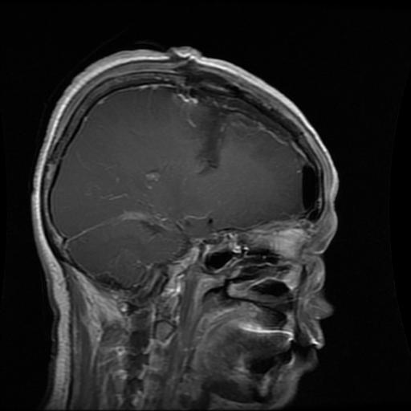
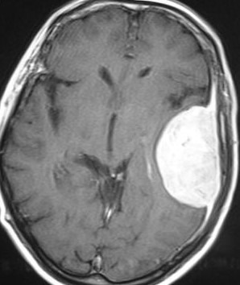
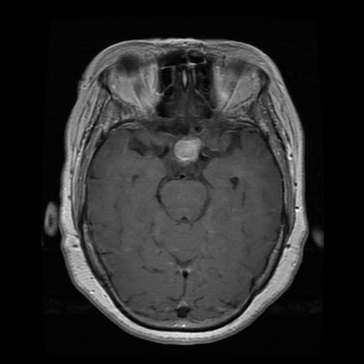
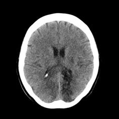

# 🧠 Brain Tumor MRI Image Analysis – Day 1

This project is part of my 3-month summer research on AI for medical imaging.

## 📌 Goal of Day 1

- Load and visualize MRI brain images
- Understand the structure of the dataset
- Prepare environment for future modeling

## 📁 Dataset

- Source: [Kaggle – Brain Tumor MRI Dataset](https://www.kaggle.com/datasets/masoudnickparvar/brain-tumor-mri-dataset)
- Categories: `glioma`, `meningioma`, `pituitary`, `notumor`

## 📸 Sample Visualizations

<table>
  <tr>
    <td><b>Glioma</b></td>
    <td><b>Meningioma</b></td>
    <td><b>Pituitary</b></td>
    <td><b>No Tumor</b></td>
  </tr>
  <tr>
    <td></td>
    <td></td>
    <td></td>
    <td></td>
  </tr>
</table>

## 🛠️ Tech Stack

- Python, Google Colab
- PIL, Matplotlib
- Dataset Management via OS module

## 📁 Project Structure

- `notebooks/` – Jupyter notebooks for each stage (currently Day 1)
- `data/` – Sample MRI images for visualization
- `models/` – (empty) Placeholder for trained models
- `reports/` – (empty) For future analysis outputs
- `README.md` – Project overview and progress
- `requirements.txt` – Dependencies (minimal)

